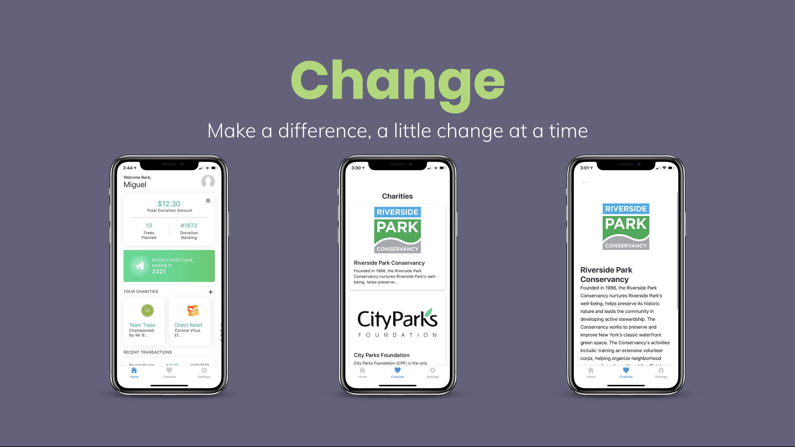
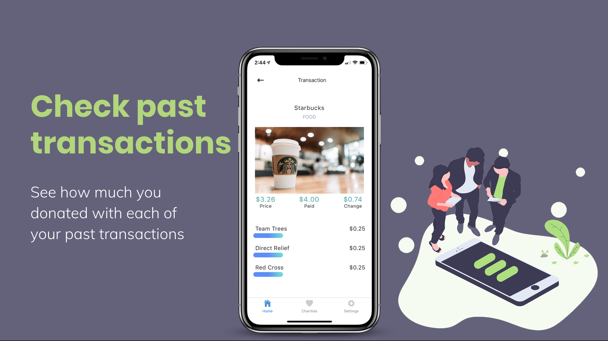
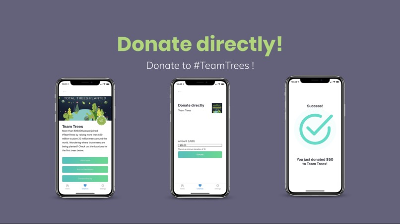

# Change
### Turn your change into donations for charities. Make a difference, a little *change* at a time.

## Inspiration
We need to create a more sustainable environment, and we need everyone's help to do that together. Environmental organizations these days are not getting enough government funding nor are they getting nearly enough donations. "Americans gave $410 billion to charities in 2017. Only 3% of all donations go to environmental charities ($11.83 billion)," - nonprofitsource, 2017. What we realized was that lots of environmental charities have clunky, outdated websites and donation features. To tackle this issue, we thought, "what better way than to seamlessly integrate donations into your everyday life?"

## What it does
Change is an app that helps you round up your recent purchases, and then donates that extra change to a wide range of environmental charities! This way, you can go about making your everyday purchases and know that you’re making a change in the world with every purchase you make. 45% of donors are enrolled in a monthly giving program, and so we believe that if we provide people with a similar program to make routine donations, they are likelier to sign up and start donating to environmental organizations.

To participate, all you need to do is create an account, add a credit card that you use everyday, and start making purchases - Change takes care of the rest! Our app pulls your recent credit card transactions from your bank and rounds the purchase price up to an amount of your choosing. Every week, we automatically sum up that "extra change" and donate it to environmental charities, either charities that you pick personally or the ones we have set up already. If you want to, you can even donate to the charities directly!

## How we built it
We built a front-end mobile interface using React-Native, allowing us to run and test our app with Expo. We used a NodeJS/Express back-end to connecting to a charity navigation API to search up environmental charities for our app. We also leveraged the Plaid API to connect to various major banks, allowing us to both retrieve transaction data as well as to charge a user for their donation on their credit card.

## Challenges we ran into
Designing an intuitive user interface was a big challenge for us. Even though most of us have done web development with React, none of us really touched React-native before this project. None of us are that great at design either, and so designing a user-friendly application on a mobile platform was our biggest challenge.

## Accomplishments that we're proud of
Currently supporting various environmental charities partnered with the Charity Navigator program.

Currently supporting most major banks using the Stripe API.

## What we learned
It can be difficult to find the proper charity API to use! Many charity APIs don't work that well, and we were lucky to find Charity Navigator which allows for searching and filtering on hundreds of charities worldwide.

Integrating a bank API can be difficult as we need to provide proper and secure access to a user's account.

## What's next for Change
While developing our product, we realized that this app could be taken to the next step by not only providing support for environmental charities, but any charity in general! Although our original inspiration was for the app to help with sustainability and environmental organizations, we'd like to also include support for any and all charities in the world that want to participate as a partner program.

Right now, we're only supporting one credit card per user, and since people usually use multiple cards on a daily basis, we do want to provide support for that in the future.

Devpost: https://devpost.com/software/change-o9yabw

